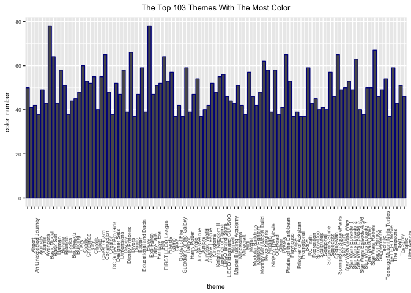

Lego
================

Legos Use of Color Over Time
============================

Combine inventory\_parts and colors datasets

``` r
names(colors)[1]="color_id"
inventory_parts_colors<-inventory_parts%>%
  merge(colors, by = "color_id")
```

Select year and id from sets

``` r
set_year<-sets%>%
  select(set_num, year)
```

Select iventory id and set\_num from inventory

``` r
inventory_set<-inventories%>%
  select(id, set_num)

names(inventory_set)[1]<-"inventory_id"
```

Merge inventory\_set and set\_uyear

``` r
inventory_set_year<-inventory_set%>%
  merge(set_year, by= "set_num")%>%
  select(inventory_id, year)
```

Combine color and year

``` r
color_year<-inventory_parts_colors%>%
  merge(inventory_set_year, by = "inventory_id")%>%
  select(inventory_id, name, year)
```

Number of Colors per year

``` r
color_year_final<-color_year%>%
  group_by(year)%>%
  mutate(color_number = n_distinct(name))

color_selected<-color_year_final%>%
  select(year, color_number)

color_final<-unique(color_selected)
```

Graph Colors Over Years

``` r
legoplot<-ggplot(data = color_final, aes(year, color_number))+geom_col(fill = "darkblue")
legoplot+ggtitle("The Number of Colors Used By Lego From 1950-2018")+theme(plot.title = element_text(hjust = 0.5))
```

 Summary Stats

``` r
summary(color_final$color_number)
```

    ##    Min. 1st Qu.  Median    Mean 3rd Qu.    Max. 
    ##    5.00   10.00   19.00   31.67   56.00   99.00

The Year with The Most Colors

``` r
color_final%>%
  filter(color_number == 99.0)
```

    ## # A tibble: 1 x 2
    ## # Groups:   year [1]
    ##    year color_number
    ##   <int>        <int>
    ## 1  2005           99

Number of Colors Per Theme
==========================

``` r
names(themes)[1]<-"theme_id"
sets_themes<-sets%>%
  merge(themes, by = "theme_id", all.x = TRUE)
theme_color<-sets_themes%>%
  merge(inventory_set, by = "set_num", all.x = TRUE)%>%
  merge(inventory_parts, by = "inventory_id", all.x = TRUE)%>%
  merge(colors, by = "color_id", all.x = TRUE)%>%
  select(c("year", "name.y", "name"))
  names(theme_color)[1:3]<-c("year", "theme", "color")
  
color_theme_final<-theme_color%>%
  group_by(theme)%>%
  mutate(color_number = n_distinct(color))

color_theme_final<-color_theme_final%>%
  select(c("theme", "color_number"))%>%
  unique()%>%
  filter(color_number>36)
```

Graph of Number of Colors Per Theme

``` r
ggplot(data = color_theme_final, aes(theme, color_number))+geom_col(color = "darkblue")+theme(text = element_text(size=8), axis.text.x = element_text(angle=90, vjust=2))+ggtitle("The Top 103 Themes With The Most Color")+theme(plot.title = element_text(hjust = 0.5))
```

 Find out What Theme Has the Max Amount of Colors

``` r
max(color_theme_final$color_number)
```

    ## [1] 78

``` r
color_theme_final%>%group_by(color_number)%>%filter(color_number == 78)
```

    ## # A tibble: 2 x 2
    ## # Groups:   color_number [1]
    ##        theme color_number
    ##        <chr>        <int>
    ## 1 Fairy-Tale           78
    ## 2  Basic Set           78

It appears Fairly-Tale and Basic Set have the most colors used.
